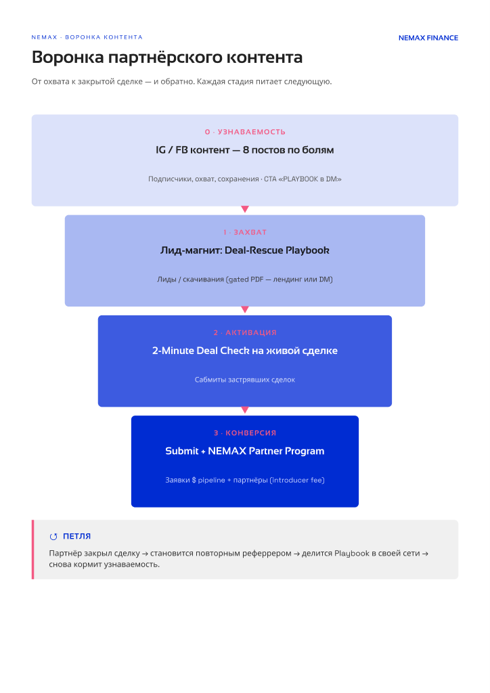

# Воронка брокеров и плейбук: почему так и что берём в работу

Собрано 28.09.2026 к созвону: какую аудиторию мы привлекаем, зачем брокеру скачивать
Playbook, что он делает после скачивания и когда предлагать звонок. Плюс почему плейбук
устроен именно так и что в нём меняем.

Коротко:

- Человек из рекламы скачал плейбук. Это первая ступень воронки, а не заявка в программу.
- Это не холодный контакт. Он увидел NEMAX, сам оставил телефон, почту, номер BRN
  и агентство и получил от нас 14 страниц. Он уже знает, кто мы.
- Сделку сразу из рекламы не приносит никто, поэтому мы идём от болей. Реклама даёт
  контакт брокера, сделка приходит позже, через письма и разбор.
- Реклама продолжает работать. С 28.09 тестируем новый текст, в котором прямо сказано,
  что NEMAX закрывает разрыв в деньгах покупателя.

---

## 1. Как задумана воронка

Так воронка была нарисована с самого начала, 25.06.2026. Плейбук на ступени **«1 Захват»**,
партнёрская программа на ступени **«3 Конверсия»**, между ними Deal Check на живой сделке.



Сам плейбук, о котором ниже идёт речь: [NEMAX-Deal-Rescue-Playbook-v2-14pp.pdf](playbook/NEMAX-Deal-Rescue-Playbook-v2-14pp.pdf).

То же самое по шагам, как сейчас работает реклама:

```
0. ВНИМАНИЕ    реклама Meta по брокерам Дубая с BRN (список реестра DLD)
      ↓
1. ОБМЕН       плейбук за контакт + BRN + вопрос «есть ли сделка сейчас?»   ← лиды рекламы ЗДЕСЬ
      ↓
2. АКТИВАЦИЯ   2-Minute Deal Check: брокер проверяет свою живую сделку
      ↓
3. ЗАЯВКА      nemax-finance.com/for-brokers → Join the Broker Programme
      ↓
4. ПРОГРАММА   реферальная ссылка → NDA и introducer agreement → кабинет → сделка → фи после закрытия
```

Плейбук стоит на **первой ступени**. Заявкой в программу считается форма на `/for-brokers`.

### Ответы на четыре вопроса

| Вопрос | Ответ |
|---|---|
| **Какую аудиторию привлекаем** | Действующих брокеров Дубая с номером BRN. Показываем рекламу по списку из реестра DLD, это реальные люди с картой брокера. Нам нужны те, у кого сделки срываются из-за денег у покупателя |
| **Зачем брокеру скачивать плейбук** | Там семь мест, где сделка срывается между Form F и передачей, и что это стоит **ему лично**: комиссию. Это полезно само по себе, поэтому брокер оставляет за это контакт и BRN |
| **Какое действие ждём после скачивания** | Прогнать свою живую сделку через Deal Check (он лежит на той же странице), потом отправить сделку или вступить в программу на `/for-brokers` |
| **Когда предлагать звонок** | **Сразу, если в форме отмечено «Yes, this week» или «Yes, this month».** Остальным два-три полезных письма, звонок после их ответа |

Экран «спасибо» в форме говорит: *«If you flagged a live deal, we come back within 48 hours»*.

---

## 2. Что поправляем в обработке лидов

1. **Ответ на вопрос «есть ли сделка» достаём отдельно.** Выгрузка из Центра лидов Meta
   его не содержит, только имя, почту и телефон. Ответы есть в выгрузке самой формы.
   **Проверено 28.09: все 9 лидов ответили «Not right now».** Живой сделки сейчас нет
   ни у кого. Для лид-магнита через боли это ожидаемо: брокер берёт материал заранее,
   сделка появляется позже.
2. **Два трека вместо одного.** Есть живая сделка: звонок за 48 часов. Нет сделки:
   серия писем. **Сейчас все 9 идут в трек писем.**
3. **Письма для второго трека написаны** (см. раздел 6).
4. **Новый текст рекламы** прямо говорит, что NEMAX даёт капитал, а не только бесплатный PDF.

---

## 3. Кто такой этот лид

Это не партнёр и не заявка. Но и не холодный человек из базы:

- видел рекламу NEMAX и выбрал нажать;
- **сам** оставил телефон, почту, BRN и агентство;
- большинство подтверждены в реестре DLD: действующие брокеры, в том числе из крупных агентств;
- получил от нас документ на 14 страниц с нашим именем на каждой.

**Поэтому звонить и писать можно.** Первая фраза не «давайте обсудим партнёрство»,
а вопрос про то, что он скачал.

**Заход для письма или звонка:**

> You downloaded our Deal-Rescue Playbook last week. Is there a file on your desk right now
> that's stuck on the buyer's money: a valuation gap, a non-resident, a handover payment?
> If so, we can look at it within 48 hours. If not, the Deal Check in the same pack is worth
> two minutes the next time one stalls.

---

## 4. Почему плейбук устроен именно так

### Идея

**Это инструмент брокера, а не брошюра NEMAX.** Рекламу «мы финансируем» брокер
читать не станет. Он читает о том, где теряет свою комиссию. Поэтому плейбук написан
как справочник «почему срываются сделки», и NEMAX появляется в нём как выход.
Полезный документ хранят и пересылают коллегам, рекламный выбрасывают.

### Главная мысль всего документа (стр. 3)

С 1 февраля 2025 года банки ОАЭ перестали включать в ипотеку 4% сбора DLD и 2% комиссии
агента. Теперь это платится наличными при передаче. **Комиссия брокера переехала в кэш
клиента** и конкурирует там с первым взносом. Когда у покупателя не хватает денег, первым
делом просят подвинуться по комиссии. Поэтому любой разрыв в деньгах клиента означает
деньги брокера. Весь плейбук про это.

### Логика по страницам (v2)

| Стр. | Что | Зачем |
|---|---|---|
| 1–2 | Обложка, как читать | «10 минут чтения, примени на живой сделке» |
| 3 | Рамка: брокеров в 6 раз больше, чем в 2019-м, закрывает сделки примерно каждый пятый; правило 01.02.2025 | Брокер узнаёт себя |
| 4–10 | **7 причин, почему сделка срывается** | Основная часть |
| 11 | Ещё три проблемы, которые всплывают поздно: NOC, ипотека продавца, cooling-off | Полезные знания, доверие к документу |
| 12 | Четыре выхода, когда денег не хватает, и сколько каждый стоит брокеру | Три выхода стоят брокеру денег, четвёртый (капитал под объект) сохраняет цену и комиссию |
| 13 | Пять вопросов до листинга + Deal Check | Переход от чтения к своей сделке |
| 14 | Условия (от AED 1M, до 70% стоимости, около 30 дней) и как вступить | CTA на `/for-brokers` |

Каждая из семи причин устроена одинаково: **что происходит → цифра → почему банк
не может помочь → что это стоит брокеру → выход → вопрос, который надо задать заранее.**
Шаблон один, чтобы нужное находилось быстро.

### Что закрывает: матрица болей

Боли взяты из нашей проверенной карты болей брокеров. Каждая цифра сверена
с первоисточником: CBUAE, DLD, законы Дубая.

| Боль брокера | Где | Что теряет брокер |
|---|---|---|
| Оценка банка ниже цены | 01 | Цена падает, а с ней комиссия; или продавец снимает объект |
| Нерезиденту банк даёт 60–65%, а не до 80% | 02 | Самые сильные клиенты встают уже после подписания MoU |
| Off-plan: ипотеки нет до 50–60% стройки | 03 | Сделка замирает на год, оплачена только резервация |
| Handover: деньги клиента заперты в другом объекте | 04 | Нет передачи, нет комиссии; клиент теряет 25–40% цены |
| Лимит нагрузки 50% дохода: богатый клиент с маленькой зарплатой | 05 | Сделка и вся цепочка рекомендаций |
| MoU на 30 дней, а банк думает 4–6 недель | 06 | MoU истекает, рядом ждёт кэш-покупатель |
| Клиенту нужны деньги на бизнес | 07 | Клиент продаёт объект: одна сделка вместо постоянного клиента |
| NOC, ипотека продавца, cooling-off, кэш на DLD | стр. 11, 13 | Срыв в последний момент |
| Рынок переполнен | стр. 3 | Каждая потерянная сделка стоит дороже |
| AML / goAML | стр. 14, оговоркой | NEMAX это не решает, поэтому прямо сказано: это зона брокера |

Итого закрыто 11 из 12 болей. **Семь причин и их порядок не меняем:** на них построены
тизеры кампании в Instagram.

**Почему нет слов «loan», «кредит», «mortgage» о нашем продукте:** NEMAX работает как
co-financing, а не кредитование. Это требование комплаенса.

---

## 5. Что меняем в плейбуке (v3)

| Что | Как в v3 |
|---|---|
| Связь с NEMAX видна только на стр. 12 и 14 | На стр. 2 блок «What NEMAX does», в каждой из семи глав блок «Where NEMAX fits» и призыв |
| Стр. 11 и 13 уводят от основной линии | Перенесены в конец как приложение |
| Причина 07 не про сделку брокера | Переписана: «клиент продаёт объект ради денег, вы теряете собственника» |
| Английский плотный и книжный | Короткие фразы, обычные слова. Для брокеров, у которых английский не родной |

Текст v3 и письма: [playbook/PLAYBOOK_v3_TEXT.md](playbook/PLAYBOOK_v3_TEXT.md).

---

## 6. Работа

### Сделано 28.09

- [x] Запущен тест нового текста рекламы: *«NEMAX co-finances that gap so the deal completes
  on schedule»*. Сравниваем цену заявки и долю ответов «Yes».
- [x] Все заявки пришли с кадра `01_seven`, поэтому он теперь основной во всех группах.
- [x] Написан текст плейбука v3 и письма для второго трека.
- [x] Достали ответы на вопрос «есть ли сделка»: все 9 лидов ответили «Not right now».
- [x] Лиды разделены: все 9 идут в трек писем, в базе у каждого проставлен ответ.

### В работу, по порядку

| # | Что | Статус |
|---|---|---|
| 1 | Отправить 9 лидам письма прогрева. Им уже писали, поэтому начинаем с письма про оценку (день 7), а не с первого | 🔴 |
| 2 | Посмотреть заход для звонка и письма (раздел 3) | 🟡 черновик есть |
| 3 | Согласовать текст плейбука v3 | 🟡 текст есть |
| 4 | Вёрстка v3 рядом со старой версией, утверждение, замена PDF на сайте. Старый PDF не удаляем: у текущих лидов ссылка на него | 🔴 после п.3 |
| 5 | Новые заявки: первым делом смотреть ответ на вопрос «есть ли сделка» в выгрузке формы, потом решать, звонок или письма | 🟢 правило |

### Как поймём, что работает

- новые заявки: появились ответы «Yes, this week / this month» после смены текста (на старом тексте было 0 из 9);
- из тех, кому звонили: сколько прислали сделку на разбор;
- из второго трека: сколько ответили на письмо или дошли до `/for-brokers`.
