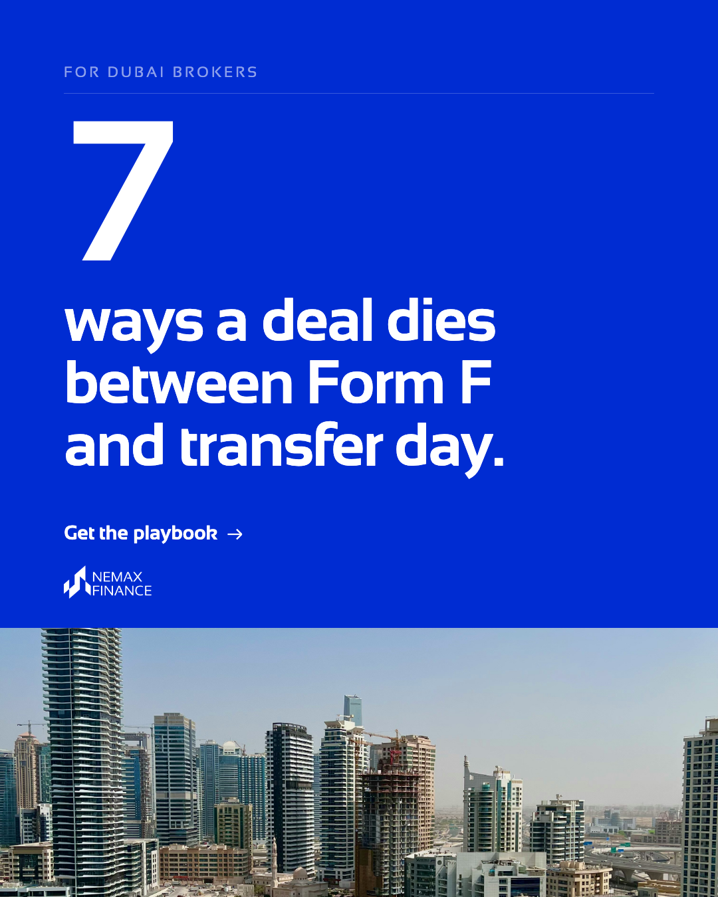
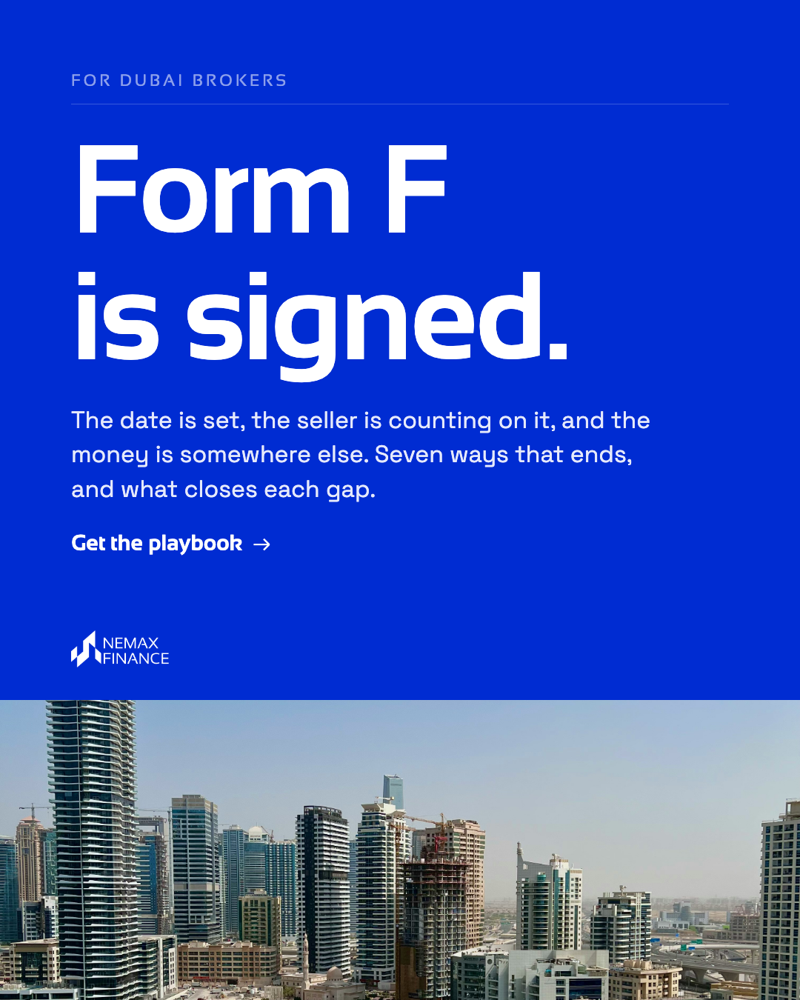

# NEMAX · реклама для брокеров Дубая — креативы и плейбук

Собрано 28.09.2026. Всё, что крутится в рекламе Meta с 18.09, и то, что человек получает после заявки.
Любой файл скачивается так: открыть его → кнопка **Download raw file** (стрелка вниз справа сверху).
Скачать всё разом: зелёная кнопка **Code** → **Download ZIP**.

## 📕 Что получает брокер после заявки

| Файл | Что это |
|---|---|
| [NEMAX-Deal-Rescue-Playbook-v2-14pp.pdf](playbook/NEMAX-Deal-Rescue-Playbook-v2-14pp.pdf) | Плейбук, 14 страниц: семь причин, по которым сделка в Дубае срывается между Form F и передачей, и что закрывает каждую. Та же версия, что отдаётся на сайте |
| [NEMAX-2-Minute-Deal-Check-v2.pdf](playbook/NEMAX-2-Minute-Deal-Check-v2.pdf) | Deal Check: одна страница, восемь вопросов по живой сделке |

Оба файла лежат на странице https://nemax-finance.com/thank-you/play-book, куда ведёт форма после отправки.

## 🟢 Креативы в эфире

Каждый кадр в трёх форматах: `4x5` — лента, `1x1` — квадрат, `9x16` — сторис.

| `01_seven` — все 9 заявок с 18.09 | `13_form_f` — в эфире с 25.09 |
|---|---|
|  |  |

**Текст объявления** (один на оба кадра):

> Seven ways a Dubai deal dies between Form F and transfer day, and the structure that answers each one. Fourteen pages, written for brokers who have watched it happen.

Заголовок: **The Deal-Rescue Playbook** · Описание: **Free, fourteen pages** · Кнопка: **Download**

**Тест с 28.09** — тот же кадр `01_seven`, текст прямо говорит, что делает NEMAX:

> A Dubai deal reaches Form F, the buyer is short at completion, and the transfer slips. The commission goes with it. NEMAX co-finances that gap so the deal completes on schedule.

Заголовок: **No transfer, no commission** · Описание: **Free playbook for brokers**

**Форма внутри объявления:** имя, почта, телефон, BRN, агентство и вопрос
«Do you have a deal that needs capital right now?» (Yes, this week / Yes, this month / Not right now).

## Остальные кадры

Сделаны, но сейчас не крутятся. Лежат в [creatives/2_other](creatives/2_other).

| Кадр | Что на нём | Статус |
|---|---|---|
| `02_no_transfer` | «No transfer, no commission.» | не запускался |
| `03_terms` | AED 1M / до 70% / 30 дней | не запускался |
| `04_where_deals_stall` | три строки со стрелками | не запускался |
| `05_playbook` | обложка плейбука | был в эфире 18–27.09, 0 переходов, на паузе |
| `06_teaser1_handover` | «Handover is called. The money is elsewhere.» | не запускался |
| `07_teaser2_residency` | «Strong buyer. Wrong residency.» | не запускался |
| `08_teaser3_clocks` | 30 дней против четырёх-шести недель | не запускался |
| `09_deal_check` | первая страница Deal Check | не запускался |
| `10_eight_questions` | четыре вопроса из восьми | не запускался |
| `11_bank_no` | «No.» | отклонён |
| `12_fourteen` | «14» | не выбран |
| `14_asset_yes` | «Yes.» | не выбран |
